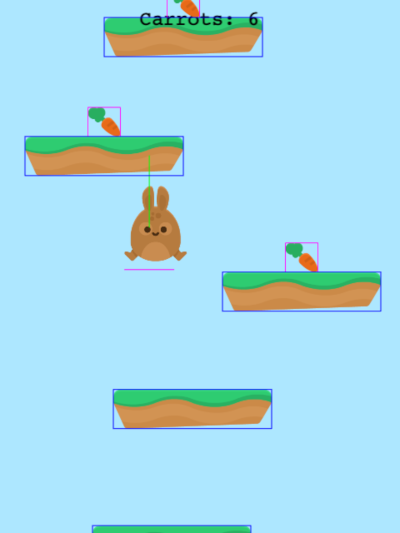

# Infinite_Jumper_Phaser3_Typescript_Webpack

"Infinite Jumper in Phaser 3" in typescript + webpack, download the book for free https://ourcade.co/books/infinite-jumper-phaser3

## Requirements

[Node.js](https://nodejs.org) is required to install dependencies and run scripts via `npm`.

## Available Commands

| Command | Description |
|---------|-------------|
| `npm install` | Install project dependencies |
| `npm run start` | Build project and open web server running project, watching for changes |
| `npm run build` | Builds code bundle with production settings (minification, no source maps, etc..) |

## Writing Code

After cloning the repo, run `npm install` from your project directory. Then, you can start the local development
server by running `npm run start`. The first time you run this you should see the following demo run:

After starting the development server with `npm run start`, you can edit any files in the `src` folder
and webpack will automatically recompile and reload your server (available at `http://localhost:8080`
by default).

